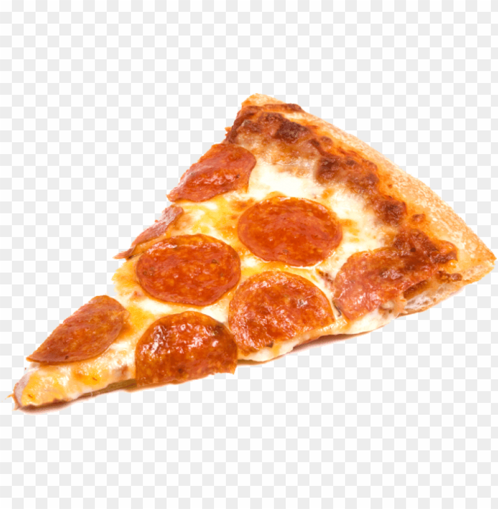

<h2>About the project</h2>

This is a small pizza ordering project. This website features a modern and intuitive design built with Tailwind Css. The functionality is made of advanced React tools & libraries.

👉 Live Demo: <a target="_blank" href='https://pizza-app-v1.netlify.app'>Pizza Demo</a>

<h3>Built with:</h3>

» React JS  
» React Router  
» Tailwind CSS  
» Redux

## Contact

Feel free to connect with me on [Linkedin](https://www.linkedin.com/in/omar-jangavadze/)

## Acknowledgments

This project was made from [udemy course](https://www.udemy.com/course/the-ultimate-react-course)
